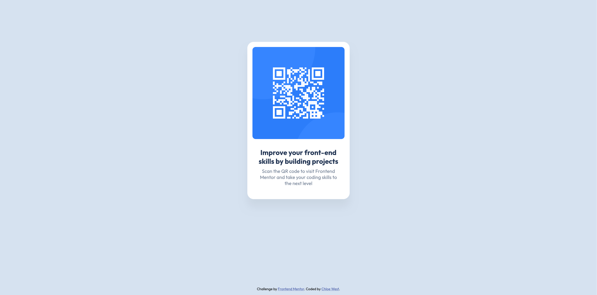
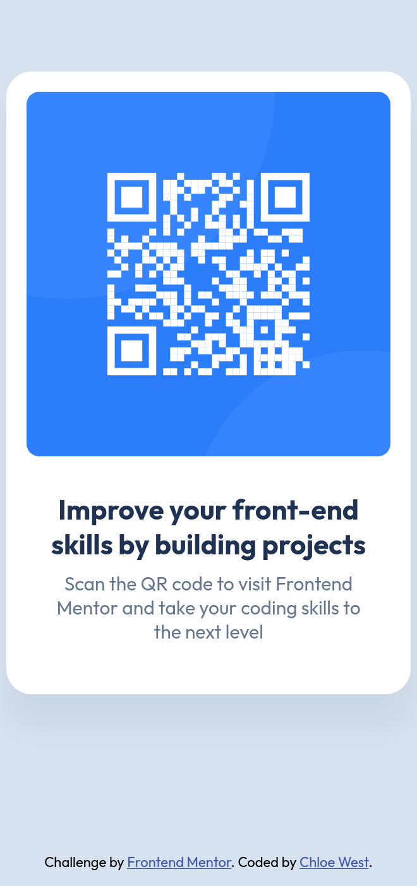

# Frontend Mentor - QR code component solution

This is a solution to the [QR code component challenge on Frontend Mentor](https://www.frontendmentor.io/challenges/qr-code-component-iux_sIO_H). Frontend Mentor challenges help you improve your coding skills by building realistic projects. 

## Table of contents

- [Overview](#overview)
  - [Screenshot](#screenshot)
  - [Links](#links)
- [My process](#my-process)
  - [Built with](#built-with)
  - [What I learned](#what-i-learned)
  - [Continued development](#continued-development)
- [Author](#author)

## Overview

### Screenshot

This is a view of my fullscreen result.

This is a view of my solution at a width of 330px.

### Links

- [Solution URL](https://chloe-we.github.io/Frontend_Mentor_Solutions/QR-code-component-challenge/)

## My process

- I decided to contain the main content of the page in an `<article>` element instead of a `
` element. I believe this is the better alternative for semantic HTML. I wasn't sure if it should be an `<article>` element or a `<section>` element. If anyone has a better solution please let me know.
- I stored all the provided styles in CSS variables for easier usage and changes.
- I started by getting all the content contained in the HTML done. Then I tried to work from the top to bottom while styling. I did jump around a little bit, and I went back to adjust the html a few times to improve the semantics.

### Built with

- Semantic HTML
- Flexbox
- CSS Grid
- CSS variables
- Mobile-first design

### What I Learned

The biggest thing was how to pull information from a Figma design file to write my code. I learned how to find simple things like padding and corner radius. I also learned the more tricky things, like how to get the box shadow information.

### Continued Development

In the future I'm hoping to practice more advanced CSS, learn JS, and start integrating new tools.

## Author

Frontend Mentor - [@chloe-we](https://www.frontendmentor.io/profile/chloe-we)